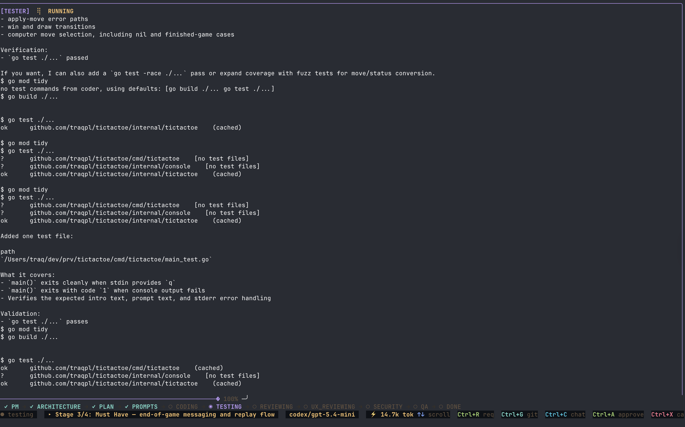
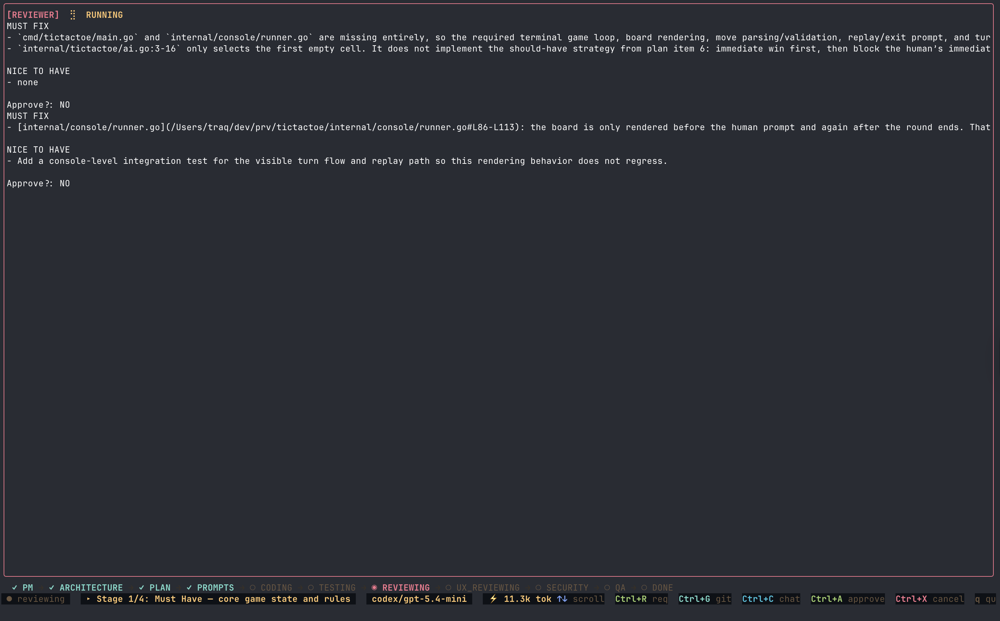

<p align="center">
  <h1 align="center">AI Coding Agents Orchestrator</h1>
  <p align="center">
    A terminal-native orchestrator that coordinates multiple AI agents to plan, code, test, review, and fix your projects — autonomously.
  </p>
</p>

<p align="center">
  <a href="https://github.com/Open-Makers/ai-coding-agents-orchestrator/blob/main/LICENSE"></a>
  <a href="https://github.com/Open-Makers/ai-coding-agents-orchestrator/releases"></a>
  <a href="https://github.com/Open-Makers/ai-coding-agents-orchestrator/actions"></a>
  
  <a href="https://goreportcard.com/report/github.com/Open-Makers/ai-coding-agents-orchestrator"></a>
</p>

---

## What Is It?

AI Coding Agents Orchestrator is an open-source CLI tool written in Go that drives a team of specialized AI agents through a structured software development pipeline. Instead of chatting with a single LLM, you define requirements in Markdown and the orchestrator runs a full **PM → Plan → Code → Test → Review → Fix → Done** workflow — with human approval gates at every critical step.

It ships with a rich terminal UI (built with [Bubble Tea](https://github.com/charmbracelet/bubbletea)) and also supports a headless plain-text mode for CI or scripting.

## What Problem Does It Solve?

Manual back-and-forth with AI coding assistants is slow, error-prone, and hard to reproduce. This orchestrator:

- **Structures the work** into well-defined phases so nothing gets skipped.
- **Runs multiple specialist agents** (PM, Planner, Coder, Tester, Reviewer, UX Reviewer, Security Auditor, QA) — each with its own prompt, skills, and model.
- **Iterates automatically** — if tests fail or reviewers find must-fix issues, the Coder fixes and the entire quality gate restarts.
- **Keeps humans in the loop** — approval gates let you review and revise architecture, plan, and prompts before any code is written.

## Features

### 8 Specialized Agents

| Agent | Role |
|-------|------|
| **PM** | Produces product vision and MoSCoW prioritization |
| **Planner** | Generates architecture, implementation plan, and stage prompts |
| **Coder** | Writes and fixes code, runs builds |
| **Tester** | Generates tests and executes test suites |
| **Reviewer** | Code review with must-fix / nice-to-have classification |
| **UX Reviewer** | UX/UI heuristic review |
| **Security** | Security audit and vulnerability scanning |
| **QA** | Corner-case and edge-case analysis |

### Interactive TUI

Full-featured terminal user interface with agent panels, live token streaming, artifact viewer, chat-based revision, and project picker.

<p align="center">
  
</p>

<p align="center">
  
</p>

<p align="center">
  
</p>

<p align="center">
  
</p>

<p align="center">
  
</p>

<p align="center">
  
</p>

### Configurable LLM Backends

Supports multiple runners out of the box:

- **OpenCode** (default)
- **Claude CLI**
- **Ollama** (local models)
- **Codex**

Each agent can use a different runner and model — configure globally (`~/.orchestrator/config.yaml`) or per-project (`.orchestrator/project.yaml`).

<p align="center">
  
</p>

<p align="center">
  
</p>

### Layered Configuration

Three-layer config with sensible defaults:

1. **Built-in defaults** — works out of the box for Go projects
2. **Global user config** (`~/.orchestrator/config.yaml`) — your preferred models and runners
3. **Project config** (`.orchestrator/project.yaml`) — project-specific overrides (language, test commands, scoping)

### Skills System

Agents are augmented with embedded skill documents (Go patterns, testing strategies, security checklists, etc.) that are injected into their system prompts.

### Human Approval Gates

The pipeline pauses for your approval at key stages:
- Product vision & MoSCoW prioritization
- Architecture
- Implementation plan
- Stage prompts

You can review, revise via chat, and approve — all from the TUI.

### Quality Gate Loop

After coding, the pipeline runs all quality checks in a single loop:
**Test → Code Review → UX Review → Security Audit → QA**

If any phase finds must-fix issues, the Coder fixes them and the loop restarts from the beginning. The cycle continues until all checks pass (or a configurable max attempt limit is reached).

### Multi-Language Prompts

LLM responses can be generated in 20+ languages — configure `prompt_language` in your config.

## Quick Start

### Prerequisites

- **Go 1.25+**
- **Git** repository to work in
- At least one LLM backend configured (e.g. OpenCode, Claude CLI, or Ollama)

### Install

```bash
# Clone and build
git clone https://github.com/Open-Makers/ai-coding-agents-orchestrator.git
cd ai-coding-agents-orchestrator
make build install

# Verify
orchestrator help
```

Or install directly:

```bash
go install github.com/Open-Makers/ai-coding-agents-orchestrator/cmd/orchestrator@latest
```

### Run

**Interactive mode** — launch the TUI, pick requirements from a file browser:

```bash
cd /path/to/your/project
orchestrator
```

**CLI mode** — pass requirements directly:

```bash
orchestrator run --requirements path/to/requirements.md
```

**On a feature branch:**

```bash
orchestrator run --requirements requirements.md --branch feat/my-feature
```

### What Happens Next

1. The **PM agent** analyzes your requirements and produces a product vision + MoSCoW plan.
2. You **review and approve** (or revise via chat).
3. The **Planner** generates architecture, an implementation plan, and per-stage prompts.
4. You **review and approve** each artifact.
5. For each stage, the **Coder** writes code, **Tester** generates and runs tests, then all reviewers run.
6. If issues are found, the Coder fixes and the quality gate restarts.
7. A final summary with all artifacts lands in `.orchestrator/`.


## License

[MIT](LICENSE) © Open-Makers
