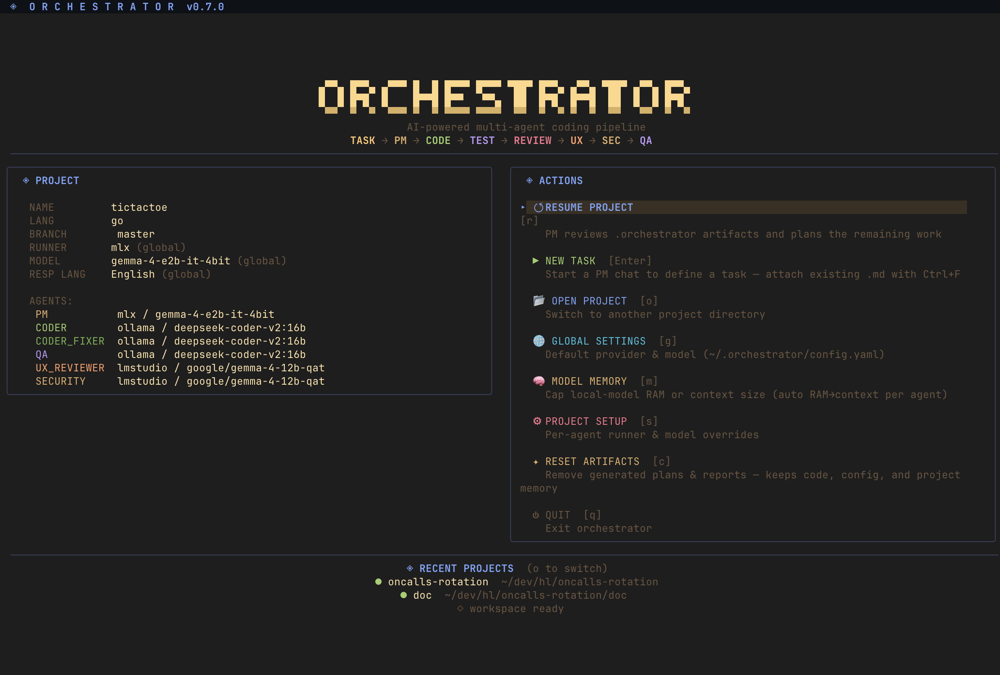
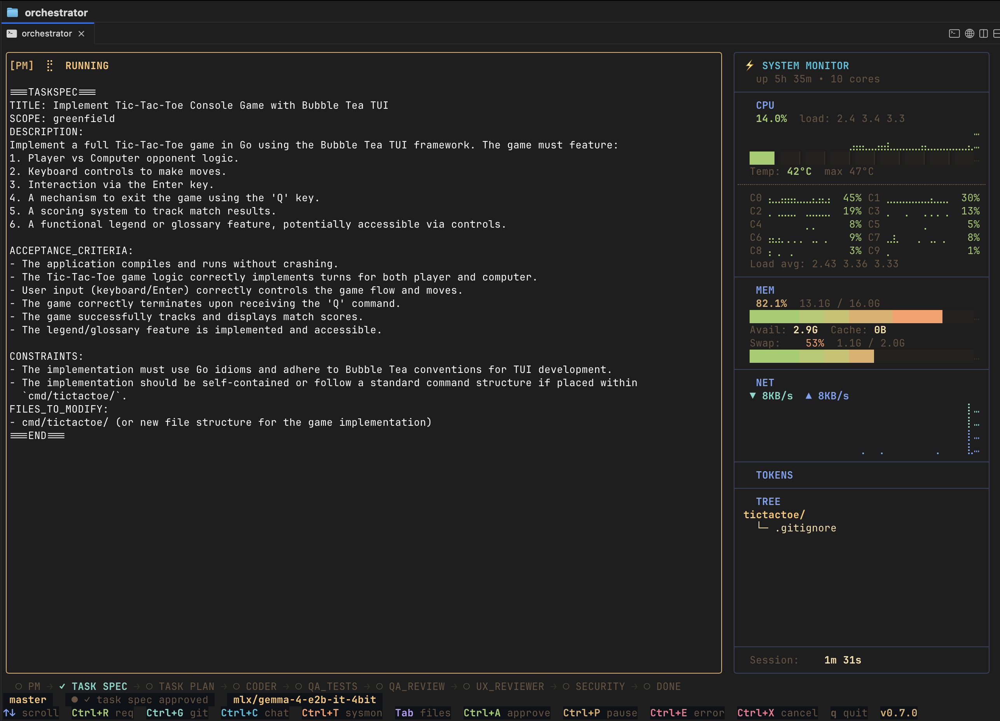
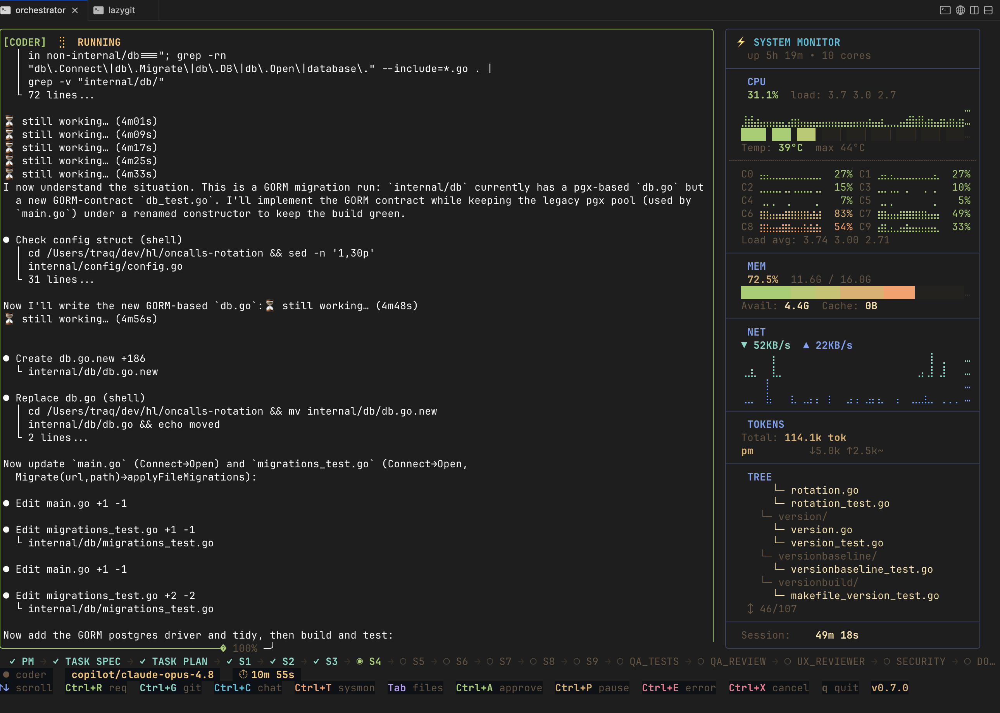
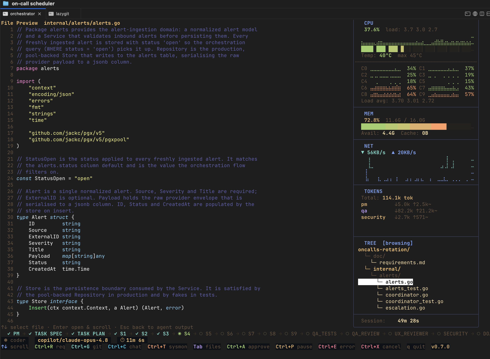
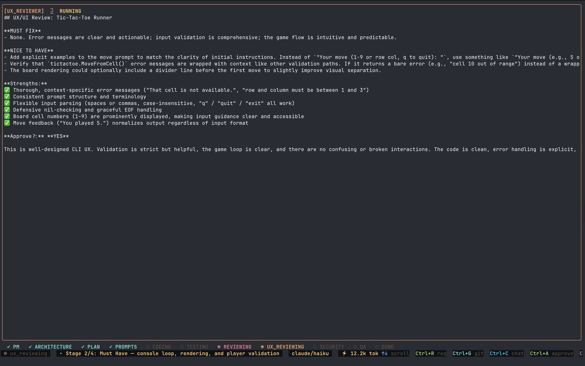
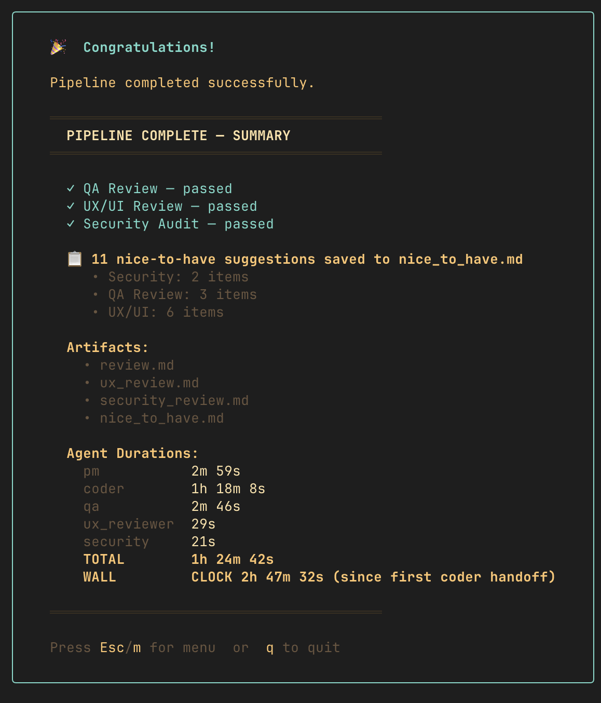
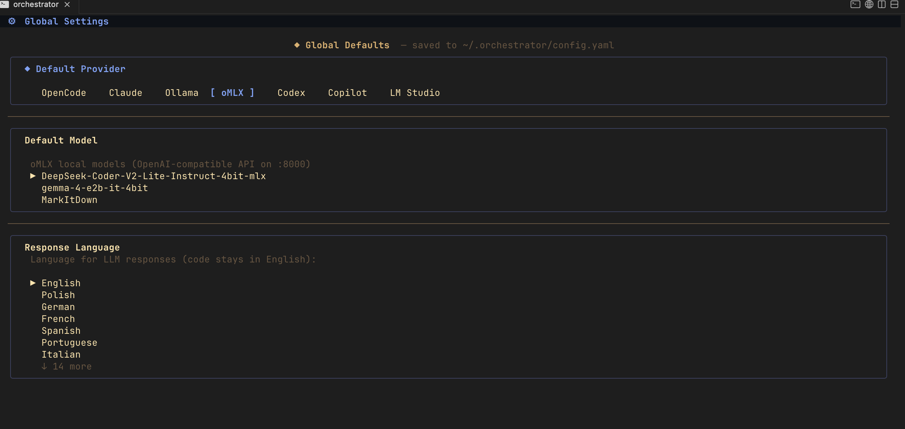
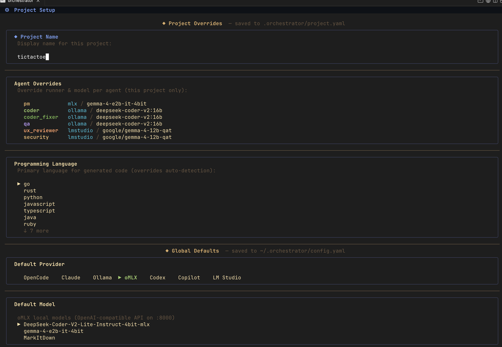
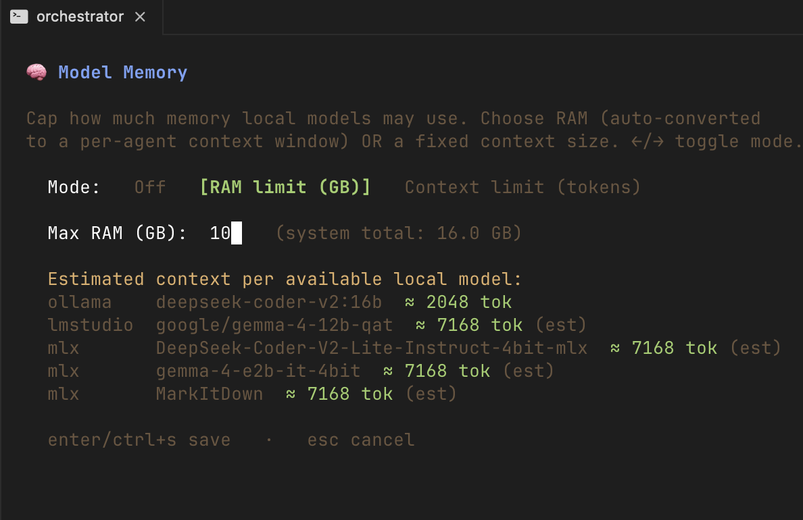

<p align="center">
  <h1 align="center">AI Coding Agents Orchestrator</h1>
  <p align="center">
    A terminal-native orchestrator that coordinates multiple AI agents to plan, code, test, review, and fix your projects — autonomously.
  </p>
</p>

<p align="center">
  <a href="https://github.com/Open-Makers/ai-coding-agents-orchestrator/blob/main/LICENSE"></a>
  <a href="https://github.com/Open-Makers/ai-coding-agents-orchestrator/releases"></a>
  <a href="https://github.com/Open-Makers/ai-coding-agents-orchestrator/actions"></a>
  
  <a href="https://goreportcard.com/report/github.com/Open-Makers/ai-coding-agents-orchestrator"></a>
</p>

---

## What Is It?

AI Coding Agents Orchestrator is an open-source CLI tool written in Go that drives a team of specialized AI agents through a structured software development pipeline. Instead of chatting with a single LLM, you describe a task in plain text and the orchestrator runs a full **Negotiate → Decompose → Implement (TDD) → Quality Review → Fix → Done** workflow — with human approval gates before any code is written.

It ships with a rich terminal UI (built with [Bubble Tea](https://github.com/charmbracelet/bubbletea)) and also supports a headless plain-text mode for CI or scripting.

## What Problem Does It Solve?

Manual back-and-forth with AI coding assistants is slow, error-prone, and hard to reproduce. This orchestrator:

- **Structures the work** into well-defined phases so nothing gets skipped.
- **Runs multiple specialist agents** (PM, Coder, QA, UX Reviewer, Security Auditor) — each with its own prompt, skills, and model.
- **Iterates automatically** — if tests fail or reviewers find must-fix issues, the Coder fixes and the entire quality gate restarts.
- **Keeps humans in the loop** — approval gates let you review and revise the task spec and execution plan before any code is written.

## Features

### 5 Specialized Agents

| Agent | Role |
|-------|------|
| **PM** | Negotiates the task spec, decomposes work into sub-tasks, and arbitrates review feedback |
| **Coder** | Writes and fixes code, runs builds and tests |
| **QA** | Generates tests (TDD), verifies test runs, and reviews code quality, logic, and corner cases |
| **UX Reviewer** | UX/UI heuristic review |
| **Security** | Security audit and vulnerability scanning |

### Interactive TUI

Full-featured terminal user interface with agent panels, live token streaming, artifact viewer, chat-based revision, and project picker.

A built-in **System Monitor** (toggle with `Ctrl+T`) shows live CPU, memory, network, and per-agent token usage. Token lines use `↓` for input (prompt) tokens, `↑` for output (generated) tokens, and a trailing `~` when the count is estimated — e.g. `coder ↓33.7k ↑4.5k~`.

See [`doc/tui.md`](doc/tui.md) for a full reference of every panel, status indicator, keyboard shortcut, and token notation, with examples.

<p align="center">
  
</p>

<p align="center">
  
</p>

<p align="center">
  
</p>

<p align="center">
  
</p>

<p align="center">
  
</p>

<p align="center">
  
</p>

### Configurable LLM Backends

Supports multiple runners out of the box:

**CLI runners** (drive an external coding-agent CLI):

- **OpenCode** (default)
- **Claude CLI**
- **Codex CLI**
- **GitHub Copilot CLI**

**Local model backends** (talk to a local OpenAI-compatible server):

- **Ollama** (`http://127.0.0.1:11434`)
- **LM Studio** (`http://127.0.0.1:1234`)
- **MLX** (Apple Silicon, `http://127.0.0.1:8000`)

Each agent can use a different runner and model — configure globally (`~/.orchestrator/config.yaml`) or per-project (`.orchestrator/project.yaml`).

<p align="center">
  
</p>

<p align="center">
  
</p>

<p align="center">
  
</p>

### Layered Configuration

Three-layer config with sensible defaults:

1. **Built-in defaults** — works out of the box for Go projects
2. **Global user config** (`~/.orchestrator/config.yaml`) — your preferred models and runners
3. **Project config** (`.orchestrator/project.yaml`) — project-specific overrides (language, test commands, scoping)

### Local Model Memory Cap

When running local models (Ollama, LM Studio, MLX), the **Model Memory** screen lets you bound resource use: pick a **RAM limit** (auto-converted to a per-agent context window based on the model and your system RAM) or a fixed **context-token limit** applied verbatim to every agent. This keeps large local models from exhausting memory.

### Skills System

Agents are augmented with embedded skill documents (Go patterns, testing strategies, security checklists, etc.) that are injected into their system prompts.

### Project Memory (OpenClaw-style)

The orchestrator persists everything important about a project as Markdown files in `.orchestrator/memory/`:

- **`MEMORY.md`** — pinned facts and decisions, prepended verbatim to every agent prompt.
- **`memory/daily/YYYY-MM-DD.md`** — auto-appended event log per pipeline run.
- **`memory/tasks/<task-id>.md`** — per-task summary on completion.

Files are indexed into a local SQLite database (FTS5/BM25) so a new task automatically recalls relevant fragments from past work — no hidden multi-session state, no vector DB. Optional embedder backends (OpenAI-compatible, Ollama) enable hybrid semantic search. See [`doc/memory.md`](doc/memory.md) for full details.

```bash
orchestrator memory show
orchestrator memory search "JWT auth"
orchestrator memory add "Use sqlc for typed queries"
```

### Human Approval Gates

The pipeline pauses for your approval before any code is written:
- **Task spec** — title, scope, and description negotiated with the PM
- **Execution plan** — the decomposition into sub-tasks (`task_plan.md`), pre-reviewed by Security and QA

You can review, revise via chat, and approve — all from the TUI.

### Pipeline Algorithm

The orchestrator runs a deterministic, resumable pipeline:

1. **Collect context** — scans the project (greenfield vs. brownfield, language, toolchain) and recalls relevant fragments from project memory.
2. **Negotiate** *(human gate)* — the **PM** turns your task input into a structured `TaskSpec`; you approve or re-negotiate via chat.
3. **Decompose** *(human gate)* — the **PM** splits the spec into ordered sub-tasks. The plan is pre-reviewed by **Security** and **QA**, then rendered to `task_plan.md` for your approval. Sub-tasks are tracked as **beads** (durable issues) so the run is resumable.
4. **Implement + Quality Review loop** *(autonomous, capped iterations)*:
   - **Phase A — Tests first (TDD):** **QA** writes tests for *all* sub-tasks before any implementation.
   - **Phase B — Implement:** the **Coder** implements every sub-task in bead order.
   - **Phase C — Global build/test/fix:** one project-wide build → test → fix loop after all sub-tasks are implemented.
   - **Phase D — Quality review:** **QA**, **UX Reviewer**, and **Security** review the result. The **PM** arbitrates all feedback in a single verdict; must-fix issues become new beads and the loop restarts. Nice-to-haves are deferred.
5. **Finalize** — emits a summary and `nice_to_have.md`, updates project memory, closes the beads, and clears resume state.

Any interrupted run can be resumed: the orchestrator reloads the spec and sub-task plan, re-establishes build/test state, and finishes the remaining open beads without re-negotiating.

### Quality Gate Loop

After implementation, the pipeline runs all quality checks:
**QA Review → UX Review → Security Audit → PM Arbitration**

If the PM classifies any feedback as must-fix, those items become new sub-tasks (beads), the Coder fixes them, and the loop restarts from implementation. The cycle continues until all checks pass (or a configurable max iteration limit is reached).

## Quick Start

### Prerequisites

- **Go 1.26+**
- **Git** repository to work in
- At least one LLM backend installed and configured — a CLI runner (**OpenCode**, **Claude CLI**, **Codex CLI**, or **GitHub Copilot CLI**) or a local model server (**Ollama**, **LM Studio**, or **MLX**)
- **[bd (beads)](https://github.com/gastownhall/beads)** — recommended. Sub-tasks are tracked as durable beads, which makes runs resumable across sessions. Without `bd` the pipeline still runs, but multi-session resume of a bead-backed task is unavailable.

### Install

```bash
# Clone and build
git clone https://github.com/Open-Makers/ai-coding-agents-orchestrator.git
cd ai-coding-agents-orchestrator
make build install

# Verify
orchestrator help
```

Or install directly:

```bash
go install github.com/Open-Makers/ai-coding-agents-orchestrator/cmd/orchestrator@latest
```

### Run

**Interactive mode** — launch the TUI and start a new task or pick a requirements file:

```bash
cd /path/to/your/project
orchestrator
```

**CLI mode** — run a unified task (feature, bugfix, refactor, or greenfield) from a description:

```bash
orchestrator task --description "Add JWT auth to the login endpoint"
```

**From a file:**

```bash
orchestrator task --from-file task.md
```

**On a feature branch:**

```bash
orchestrator run --requirements requirements.md --branch feat/my-feature
```

### What Happens Next

1. The orchestrator **collects project context** and recalls relevant fragments from project memory.
2. The **PM** negotiates a structured task spec from your input — you **review and approve** (or revise via chat).
3. The **PM** decomposes the spec into ordered sub-tasks (beads); **Security** and **QA** pre-review the plan — you **review and approve** `task_plan.md`.
4. **QA** writes tests for all sub-tasks (TDD), the **Coder** implements them, then a global build/test/fix loop runs.
5. **QA**, **UX Reviewer**, and **Security** review the result; the **PM** arbitrates. Must-fix issues become new sub-tasks and the loop restarts.
6. A final summary and all artifacts land in `.orchestrator/`.


## License

[MIT](LICENSE) © Open-Makers
